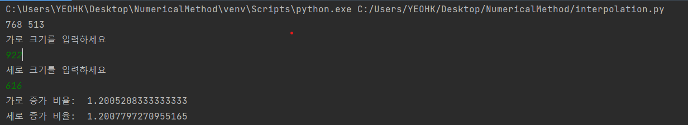
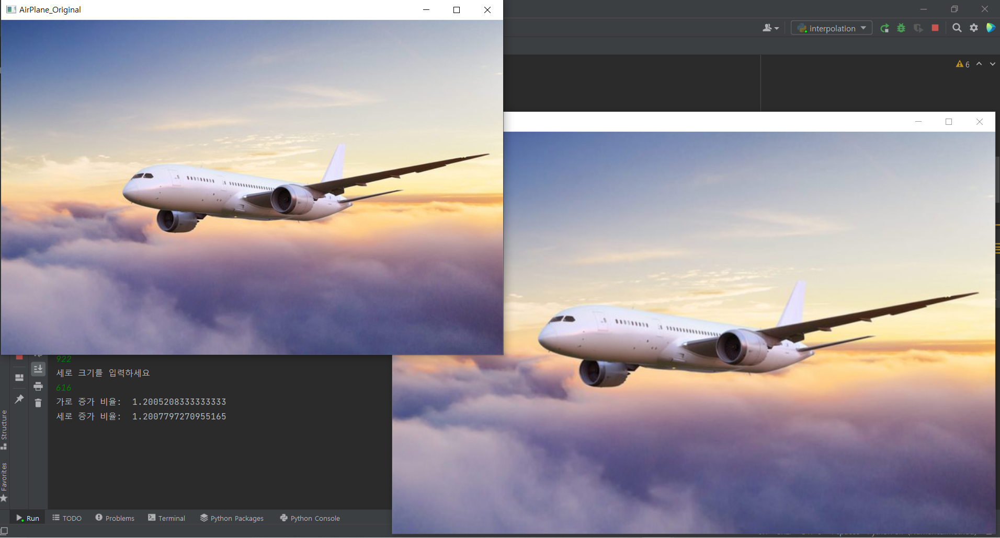

# Hw6 (Bilinear Interpolation)

## 환경

- OS: Linux 20.04

- 언어: Python

  - Pycharm을 이용한 가상환경에서 구현.

  - packages

    1. opencv-contrib-python

    2. numpy

       

## 실행순서

1. 코드 실행(Run).
 
2. console창에 출력되는 것과 같이 원하는 이미지 크기 지정.
3. 결과 확인

## 결과

- 콘솔창 입력

- 결과
  - AirPlane_Original이 원본, AirPlane_Output이 결과 이다.

