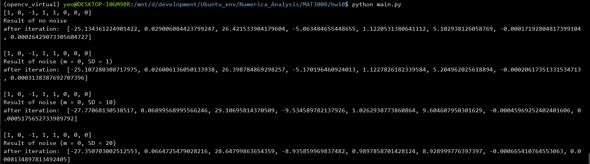
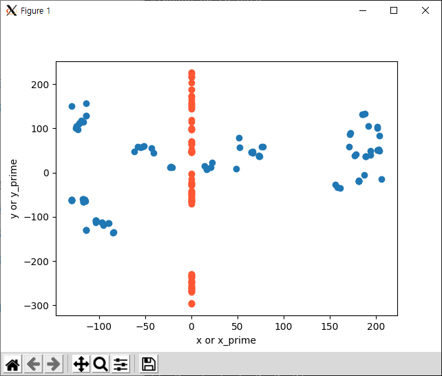
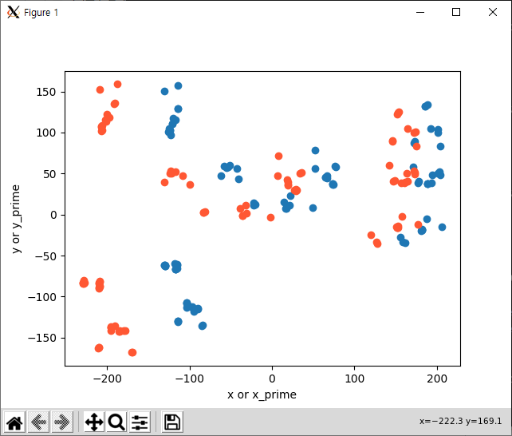
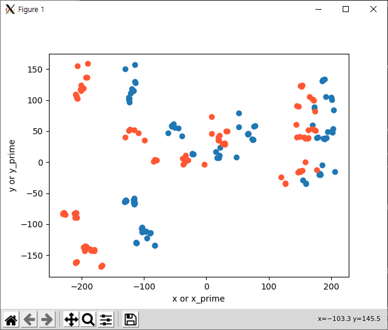
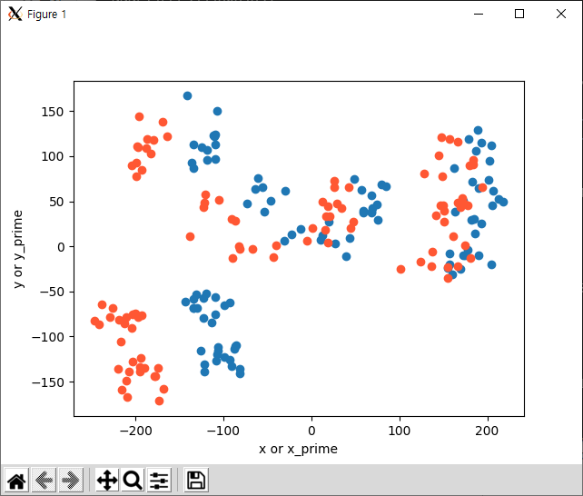
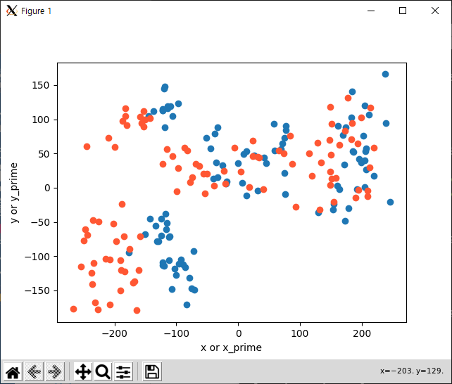

# HW10 (2D transformation)

## 환경

- OS: Window10 / Ubuntu18.04
- 언어: python3.7 (matplotlib, pandas, numpy)


## 실행순서

```
1. 적절한 data.csv를 main.py와 같은 폴더에 위치시킴.
2. python main.py
3. 결과 확인.
```


## 코드 설명

- main(): 전체적인 flow진행. matplotlib을 통해 초기 상태의 data분포를 나타낸다. LMM()함수를 호출하여, transformation parameter를 구한다. gaussian random number를 각각 추가해서 LMM()을 다시 호출하는 역할을 한다. 

- LMM(): Levenberg-Marquardt 알고리즘을 수행한다. 초기 lambda는 0.001로 설정했으며, 특별한 종료 조건 없이, 30번 iteration을 돌면 종료하게 설정했다. 이는, 여러번 수행한 결과 30번이면 유의미한 결과를 도출해내기 때문이다. Hessian inverse matrix를 구할 땐, library함수를 사용했다. 

  - a11, a12, a13, a21, a22, a23, a31, a32는 a[8]로 나타냈다.
  - 그 외의 과정은 강의 pdf에 따랐다.

- 전체적인 코드

  - csv를 읽기 위해 pandas를 사용했다.

  - 본 함수의 분모와 분자를 나누어서 계산했다.

  - chi_square를 쉽게 계산하기 위해, 각 parameter에 대해 미분해주는 별도의 함수를 정의했다.

    

## 결과

- (x', y') 은 파란색으로 나타낸 점들이다.
- (f(x, y), g(x, y))는 주황색 점들이다. 
  - x' = f(x, y), y' = g(x, y) 
- 초기값을 넣었을 때, 함수 결과는 유의미하지 않고, linear하다.
- noise가 커질수록 좌우 transform의 형태가 무너지고 있음을 알 수 있다. 


### parameter 결과

- 초기 parameter a[a11, a12, a13, a21, a22, a23, a31, a32] = [1, 0, -1, 1, 1, 0, 0, 0]으로 설정했다.

- iteration 후 parameter결과는 아래와 같다. 배열 순서는  a[a11, a12, a13, a21, a22, a23, a31, a32] 이다.

  ```
  1. no noise
   	a =  [-25.134361224901422, 0.029006084423799247, 26.421533904179604, -5.063484655448655, 1.1220531380641112, 5.102938126058769, -0.00017192804817399104, 0.00026429073305604727]
  
  2. SD = 1
  	a =  [-25.362458594256356, 0.03006302632224475, 26.648764979046234, -4.923326222649432, 1.1220805042839517, 4.961817268083062, -0.00015042584580296807, 0.00024061226613988603]
  
  3. SD = 10
  	a =  [-23.668745529710307, 0.043836778210819716, 24.972635241122234, -6.376540074896244, 1.0542122651189332, 6.440046950758487, -0.00037590521922446703, 0.0005173985871271049]
  
  4. SD = 20
  	a =  [-24.32708378825794, 0.0875311824027517, 25.650316614025765, -5.229728855472098, 1.008824156153641, 5.293103738545204, -0.0004385514148244412, 0.0006590406859142534]
  ```

  

- iteration할 때마다, parameter의 값들이 동일한 간격으로 늘어남을 확인했다. 



### initial state




### with no noise



### with noise SD = 1



### with noise SD = 10



### with noise SD = 20


