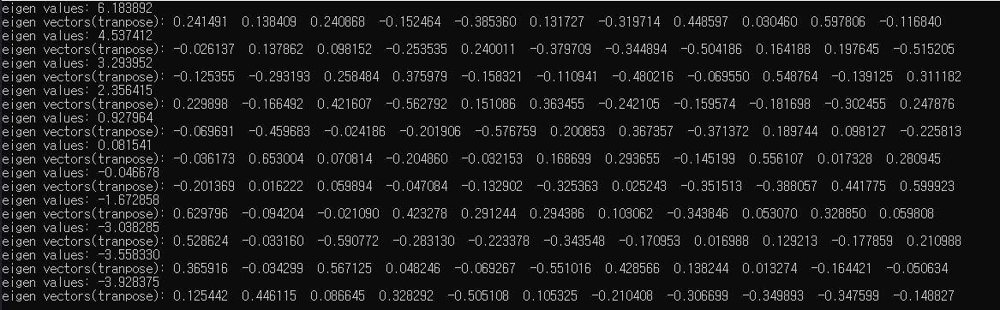

# HW7 (Eigen Values, Eigen Vectors)

## 환경

OS: Window10

언어: C11

Visual Studio Community 2019


## 실행순서 

```
1. visual studio 빈프로젝트 생성
2. 소스코드 및 헤더파일 복사.
3. ctrl+f5
```

## 코드

- 필요한 matrix 생성 및 random number generation
- jacobi()와 eigsrt()실행.

## 결과




