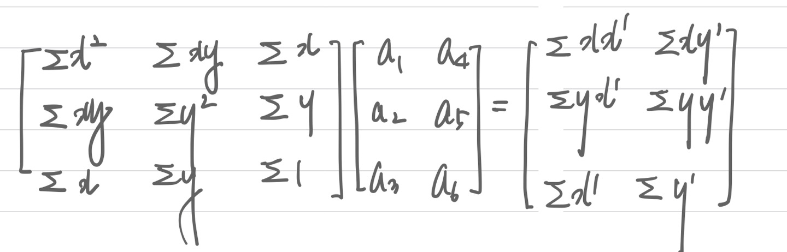
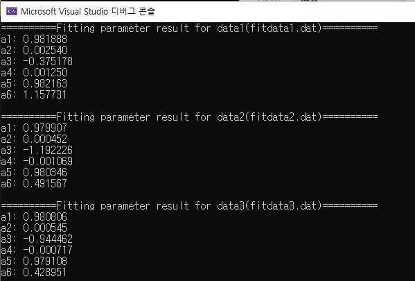

# HW9 (DataFitting)

## 환경

- OS: Window10
- 언어: C11
- Visual Studio Community 2019

## 실행순서

```
1. visual studio 빈프로젝트 생성
2. 해당 파일들을 소스코드에 복사.
3. '프로젝트 속성 -> 디버깅 -> 작업 디렉토리'에 소스파일 및 data file path 설정
4. Data file은 하위 directory data에 넣기. 
5. ctrl+f5

3번 ex) D:\development\Ubuntu_env\Numerica_Analysis\hw9
4번 ex) D:\development\Ubuntu_env\Numerica_Analysis\hw9\data 에 .dat 파일 넣기
```

## 과정

1. dat파일을 x, y, xp, yp 배열로 각각 복사함. 




2. 위의 수식에 맞춰 matrix를 생성함. 코드에선, A, para 2개의 matrix 생성. 
   - (a1 ~ a6 matrix는 따로 생성하지 않음. para에 결과가 저장되기 때문이다.)
   - A*x = para
   - x의 값들이 para에 저장됨. 
3. gaussj()함수를 활용해서 수식을 품.


## 결과

